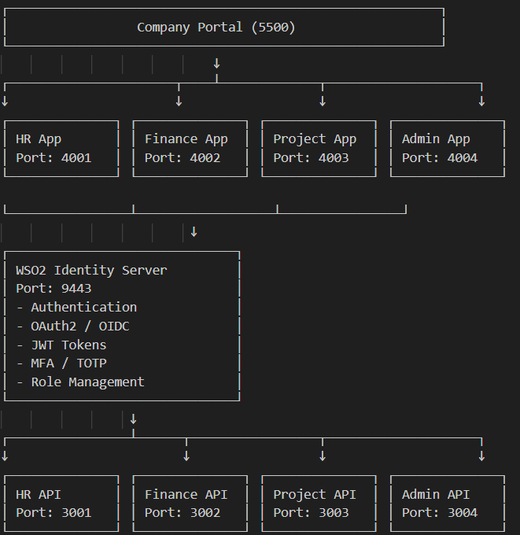
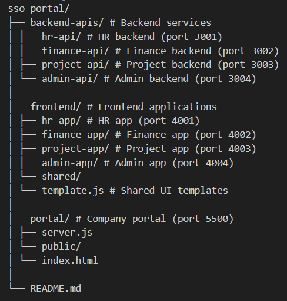
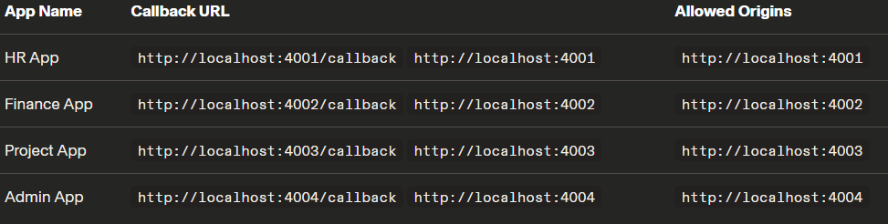
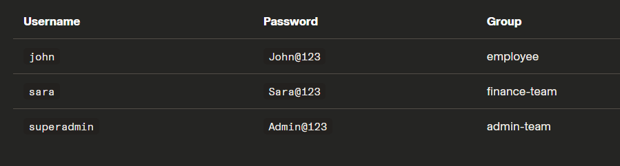

# 🏢 Enterprise SSO Portal with WSO2 Identity Server

A complete **Single Sign-On (SSO)** platform built with **WSO2 Identity Server 7.2.0**, featuring multiple integrated applications, role-based access control, and multi-factor authentication.


---

## 🌟 Features

### 🔐 Authentication & Security

- ✅ **Single Sign-On (SSO)** across 4 applications
- ✅ **OAuth 2.0 / OpenID Connect** authentication
- ✅ **JWT Token** based authorization
- ✅ **Multi-Factor Authentication (MFA)** with TOTP
- ✅ **Single Logout (SLO)** - logout from all apps at once
- ✅ **Session Management** with secure cookies

### 🛡️ Authorization

- ✅ **Role-Based Access Control (RBAC)**
- ✅ **3 User Roles**: Employee, Finance Team, Admin Team
- ✅ **Dynamic UI** based on user permissions
- ✅ **Protected Routes** with middleware
- ✅ **Access Denied Pages** for unauthorized access

### 🎨 User Experience

- ✅ **Modern Responsive UI** with Tailwind CSS
- ✅ **Mobile-Friendly** design
- ✅ **User Profile Pages** with token info
- ✅ **Beautiful Login Pages**
- ✅ **Dashboard with Sidebar Navigation**
- ✅ **Real-time Permission Indicators**

---

## 🏗️ Architecture



---

## 🛠️ Tech Stack

| Component         | Technology                 |
| ----------------- | -------------------------- |
| Identity Provider | WSO2 Identity Server 7.2.0 |
| Backend APIs      | Node.js + Express          |
| Frontend Apps     | Node.js + Express + EJS    |
| UI Framework      | Tailwind CSS               |
| Authentication    | OAuth 2.0 / OpenID Connect |
| Token Type        | JWT (JSON Web Token)       |
| Session Store     | Express Session            |
| HTTP Client       | Axios                      |

---

## 📦 Project Structure



---

## 🚀 Getting Started

### Prerequisites

- **Node.js** v16+ ([Download](https://nodejs.org/))
- **WSO2 Identity Server 7.2.0** ([Download](https://wso2.com/identity-server/))
- **Java JDK 11+** (Required for WSO2 IS)

### 1. Setup WSO2 Identity Server

1. Download and extract WSO2 IS 7.2.0
2. Start the server:

   ```bash
   cd <WSO2_IS_HOME>/bin
   ./wso2server.sh    # Linux/Mac
   wso2server.bat     # Windows

   ```

3. Access console: https://localhost:9443/console
4. Login: admin / admin

### 2. Configure Applications in WSO2 IS

Create 4 OIDC applications in WSO2 IS Console:


For each app, enable:

- Grant Types: Code, Refresh Token
- Token Type: JWT
- User Attributes: Email, Username, First Name, Last Name, Groups, Roles

### 3. Create Users and Groups

Groups:

- employee
- finance-team
- admin-team

# Test Users:



### 4. Install Project Dependencies

```bash
 # Install all backend dependencies
cd backend-apis/hr-api && npm install
cd ../finance-api && npm install
cd ../project-api && npm install
cd ../admin-api && npm install

# Install all frontend dependencies
cd ../../frontend/hr-app && npm install
cd ../finance-app && npm install
cd ../project-app && npm install
cd ../admin-app && npm install

# Install portal dependencies
cd ../../portal && npm install

```

### 5. Configure Client IDs and Secrets

In each frontend app's app.js, update the CONFIG:

```bash
 const CONFIG = {
  IS_URL: 'https://localhost:9443',
  CLIENT_ID: 'YOUR_CLIENT_ID_FROM_WSO2',
  CLIENT_SECRET: 'YOUR_CLIENT_SECRET_FROM_WSO2',
  REDIRECT_URI: 'http://localhost:4001/callback',
  SCOPE: 'openid profile email groups',
  BACKEND_API: 'http://localhost:3001'
};

```

### 6. Run the Project

Option 1: Run Manually (9 terminals)

```bash
# Backend APIs
cd backend-apis/hr-api && node server.js
cd backend-apis/finance-api && node server.js
cd backend-apis/project-api && node server.js
cd backend-apis/admin-api && node server.js

# Frontend Apps
cd frontend/hr-app && node app.js
cd frontend/finance-app && node app.js
cd frontend/project-app && node app.js
cd frontend/admin-app && node app.js

# Portal
cd portal && node server.js

```

### Option 2: Run with Script (Windows)

```bash
./start-all.bat

```

### 7. Access the Portal

Open browser: http://localhost:5500

### 🧪 Testing

Test User Scenarios

👤 Test as Employee (John)

- Username: john
- Password: John@123

Expected Behavior:

- ✅ HR App: Can apply leave, view own data (requires MFA)
- ❌ Finance App: Access Denied
- ✅ Project App: Can view & create tasks
- ❌ Admin App: Access Denied

---

- Username: sara |
- Password: Sara@123 |

Expected Behavior:

- ✅ HR App: Can view all leave records
- ✅ Finance App: Full access to salary & expenses
- ✅ Project App: Read access
- ❌ Admin App: Access Denied

---

- Username: superadmin
- Password: Admin@123

Expected Behavior:

- ✅ All apps: Full access
- ✅ Admin Panel: Can manage users

# Test SSO Flow

1. Login to HR App
2. Open Finance App in same browser
3. ✅ Auto-login (no password required)

# Test MFA (HR App only)

1. Login as john to HR App
2. Enter password
3. Asked for TOTP code
4. Enter 6-digit code from Google Authenticator
5. ✅ Logged in successfully

### 📚 Key Concepts Demonstrated

# OAuth 2.0 / OIDC Flow

1. User clicks "Login"
2. App redirects to WSO2 IS authorize endpoint
3. User enters credentials
4. WSO2 IS validates and issues authorization code
5. App exchanges code for access token
6. App uses token to get user info
7. App establishes session

# Role-Based Access Control (RBAC)

```bash
function requireAnyRole(roles) {
    return (req, res, next) => {
        if (!hasAnyRole(req.session.user, roles)) {
            return res.status(403).send('Access Denied');
        }
        next();
    };
}

// Usage
app.get('/dashboard', requireLogin, requireAnyRole(['finance-team', 'admin-team']), ...);

```

# Single Sign-On

WSO2 IS maintains a session cookie (commonAuthId) at localhost:9443. When users access another app, the IS detects this cookie and automatically logs them in without password.

# 🔐 Security Features

- ✅ OAuth 2.0 Authorization Code Flow with PKCE
- ✅ JWT Token Validation on every request
- ✅ Role-Based Access Control at route level
- ✅ Multi-Factor Authentication (TOTP)
- ✅ Secure Session Management
- ✅ HTTPS for Identity Server
- ✅ CSRF Protection via OAuth state parameter
- ✅ Token Expiration and refresh

# 👨‍💻 Author

Kalana Heshan

- GitHub: [@kalana250](https://github.com/kalana250)
- LinkedIn: https://www.linkedin.com/in/kalana-heshan/
- Email: heshankalana168@gmail.com

🙏 Acknowledgments

- WSO2 Identity Server - Open source IAM platform
- Tailwind CSS - Utility-first CSS framework
- Express.js - Node.js web framework

📞 Support
If you have any questions, please open an issue or contact me at heshankalana168@gmail.com

_Built with ❤️ using WSO2 Identity Server_
